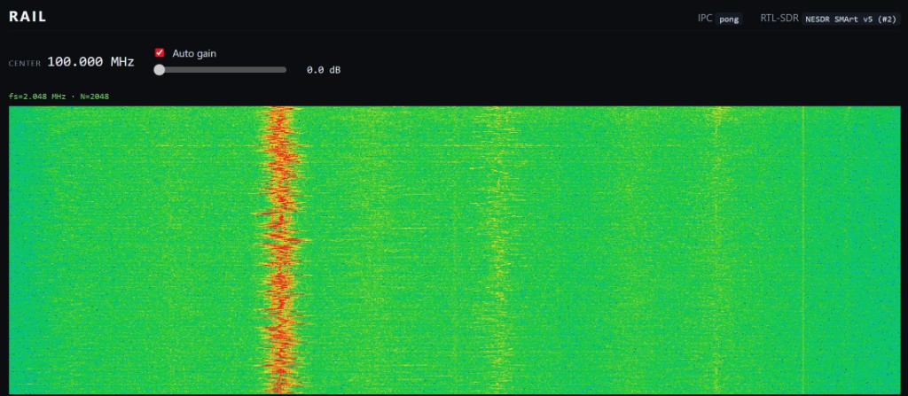

# RAIL

**Rust-based Application for Intelligent Listening.** A desktop SDR
receiver that streams IQ samples from a
[NESDR Smart v5](https://www.nooelec.com/store/nesdr-smart.html)
(or any RTL2832U-based dongle), runs the DSP pipeline in Rust, and
renders a live spectrum waterfall in a Tauri + React UI.

> **Status — Phase 1 (IQ → FFT → waterfall):** the app opens the
> dongle, streams IQ in real time, computes a windowed FFT in dB, and
> paints a scrolling waterfall at ~25 fps.
> Next phases: AM/FM/SSB demod, tuning UI, recording. See
> [`docs/TIMELINE.md`](docs/TIMELINE.md).



## Highlights

- **Rust backend, zero-GC DSP**: `rustfft` + `num-complex` + hand-tuned
  Hann windowing; samples flow through a bounded tokio `mpsc` with
  backpressure and a 25 fps emission cap.
- **Hand-written `librtlsdr` FFI** in `src-tauri/src/hardware/ffi.rs`
  (no `bindgen`, no runtime surprises). RAII device wrapper,
  panic-safe C callback, thread-safe cancel/tune handle.
- **Binary Tauri IPC**: FFT frames travel as raw `Float32` blobs over
  `tauri::ipc::Channel<InvokeResponseBody::Raw>` — no JSON in the hot
  path.
- **React 19 + Zustand + native Canvas 2D**: custom 6-stop perceptual
  colormap, `drawImage`-based scroll for O(1) per-frame rendering.

## Architecture

```
USB  ─►  librtlsdr (blocking std::thread)
          │  u8 IQ samples, 32 KiB buffers
          ▼
       tokio mpsc (depth 8, drop newest on overflow)
          │
          ▼
       DSP task  ─  iq_u8 → Complex<f32> → Hann × FFT → 20·log10
          │                                              │
          │                               emit throttle  ▼
          ▼                                      Channel<Raw bytes>
   stop/cancel on ──────────────────────────────────────┘
   frontend disconnect
                                                         │
                                                         ▼
                                                   React hook
                                                  (rAF drain)
                                                         │
                                                         ▼
                                             Canvas waterfall
```

Full details: [`docs/ARCHITECTURE.md`](docs/ARCHITECTURE.md),
[`docs/DSP.md`](docs/DSP.md), [`docs/HARDWARE.md`](docs/HARDWARE.md).

## Getting started

### Prerequisites

- Rust stable (1.85+)
- Node 20+ and npm
- [Zadig](https://zadig.akeo.ie/) to install the **WinUSB** driver for
  the RTL-SDR dongle on Windows (see `docs/HARDWARE.md` §1).
- The `librtlsdr` Windows x64 prebuilts, placed under
  `vendor/librtlsdr-win-x64/` — see that folder's
  [README](vendor/librtlsdr-win-x64/README.md).

### Run

```powershell
npm install
npm run tauri dev
```

The first build compiles the Rust backend, links against
`rtlsdr.lib`, and copies `rtlsdr.dll`, `pthreadVC2.dll`, and
`msvcr100.dll` next to the dev binary so the app runs without
touching `PATH`.

### Checks

```powershell
# Rust
cargo clippy --all-targets -- -D warnings
cargo test --lib

# Frontend
npx tsc --noEmit
npm run build
```

## Repository layout

```
src/                React 19 + TypeScript frontend (Vite)
src-tauri/          Rust backend (Tauri v2)
  ├─ src/hardware/  librtlsdr FFI, RAII device, async IQ reader
  ├─ src/dsp/       Hann, FFT, dB, fft_shift, frame builder
  ├─ src/ipc/       Tauri commands + events
  └─ build.rs       Linker + runtime DLL staging
docs/               PRD, architecture, DSP notes, conventions
vendor/             Native prebuilts (gitignored)
```

## License

TBD. This repo is currently a portfolio project and is not yet
licensed for redistribution.
