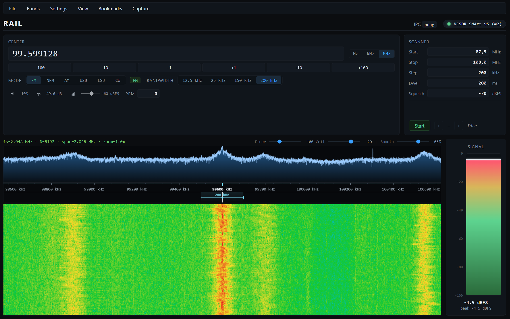

# RAIL

### *Radio Analysis & Intel Lab*

**A hands-on SDR desktop app — built to learn how the radio chain actually works.**

 

 

---

## Why this project

This is an **educational build**: I wanted to go past “press play in someone else’s app” and **own the path from antenna samples to something I can see and hear**. Along the way I cared about **craft** — a clear, dark UI that feels like a real tool, even though the goal is understanding, not beating mature SDR suites on every metric.

If you’re hiring: it’s a deliberate **full-stack signal-processing exercise** (hardware-facing backend + real-time UI), documented and iterated in the open.

---

## What you get

| | |
| :--- | :--- |
| **Live waterfall** | Scrolls in real time so you can *see* activity across the band |
| **Spectrum trace** | Magnitude curve above the waterfall for a quick read on peaks |
| **Tune the dial** | Frequency entry, steps, and click on the waterfall to jump |
| **FM & AM** | Listen through the app — the fun part after you find a carrier |
| **Signal meter** | Level + peak hold so strong vs weak signals are obvious |
| **Bookmarks** | Save stations or frequencies you care about |
| **PPM correction** | Dial in the dongle when you want things to line up |
| **Capture** | Audio to disk, IQ clips, waterfall screenshots |
| **Replay** | Open what you saved and walk through it again |

---

## What I’ve verified

So far I’ve only run this on **Windows** with **my RTL-SDR dongle**. Other setups *might* work — I just **haven’t verified** them. If something breaks on your machine, that’s useful signal; the repo is as much a **learning log** as a product.

---

## Offline demo

No dongle? The repo ships with a short sample IQ capture at [`docs/assets/demo_iq.sigmf-data`](docs/assets/demo_iq.sigmf-data) (plus its `.sigmf-meta` sidecar). Open it from the replay transport — the waterfall, spectrum, and audio paths run end-to-end against the file, so you can exercise every screen without hardware.

---

## Feedback

**All feedback is welcome** — issues, ideas, “this confused me,” or “have you thought about…”. I’m building in public partly to learn from other people who care about RF, Rust, or UI. Don’t hesitate to reach out.

---

## Going deeper

Technical notes, architecture, and DSP references live in [`docs/`](docs/). If you want to contribute code or run checks locally, see [`CONTRIBUTING.md`](CONTRIBUTING.md).

---

## License

Not finalized yet — treat this as a **portfolio / educational** repo until a proper license is added.
